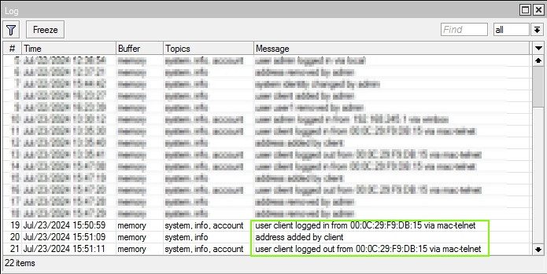

# expect-2-mikrotik

Automates the task by providing inputs. The expect command is a powerful automation tool used for scripting and automating interactive applications. It is particularly useful for tasks that require a response to prompts, such as login procedures, SSH/FTP interactions, or any other command-line based program that requires user input.

## Installation

Dockerfile
```bash
FROM ubuntu:18.04

RUN apt-get update && \
    apt-get install -y expect wget openssh-client telnet nano && \
    apt-get clean && \
    rm -rf /var/lib/apt/lists/*

WORKDIR /zone
```

Install using ./build.sh

run docker using ./docker_run.sh
## Expect Script

```shell
#!/usr/bin/expect
set host1 [lindex $argv 0]
set mac [lindex $argv 1]
set ipaddress [lindex $argv 2]
set ses 1

spawn "ssh" "-l" "user1" "-i" "./id_rsa_router" "$host1"
set ses $spawn_id
set timeout 200
expect -i $ses "*user1*@*]*>"
exp_send -i $ses "\r"
expect -i $ses "*user1*@*]*>"
exp_send -i $ses "/tool mac-telnet $mac\r"
expect -i $ses "*Login:*"
exp_send -i $ses "client\r"
expect -i $ses "*Password:*"
exp_send -i $ses "client123\r"
exp_send -i $ses "\r"
expect -i $ses "*client*@*]*>"
exp_send -i $ses "/ip address add address=$ipaddress interface=\[/interface ethernet find mac-address=$mac\]\r"
expect -i $ses "*client*@*]*>"
close
```

I have imported rsa-key into router (Mikrotik), so I can login without password ask. using this expect script I can login from host Router box into other using mac-telnet.

to generate RSA-Keys
```shell
ssh-keygen -f data/id_rsa_router -C "docker"
```

to run command 
```shell
$ docker exec -it ubuntu_expect18 ./set_remote.sh <ip address of host Router> <mac to connect to> <ip address to set on interface with mac>
```
## Screenshots




[](https://choosealicense.com/licenses/mit/)
[](https://opensource.org/licenses/)
[](http://www.gnu.org/licenses/agpl-3.0)

